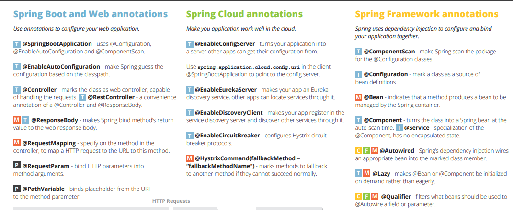
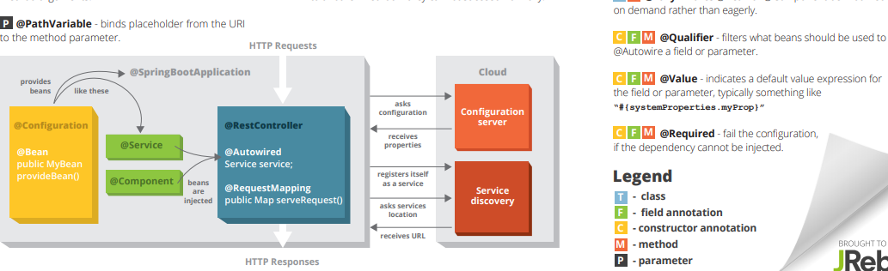
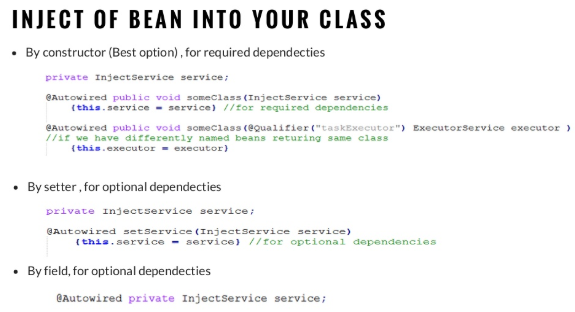
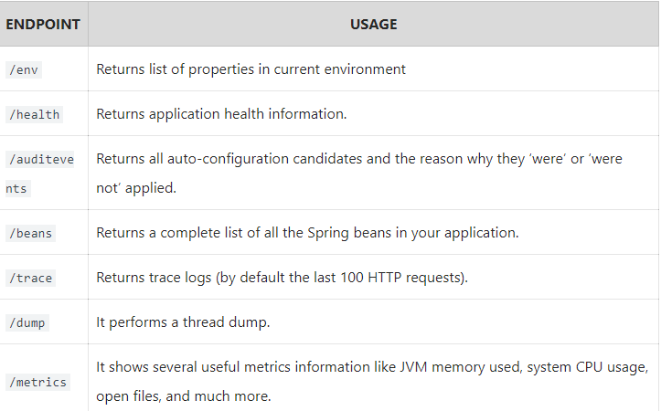

= Spring

1. Spring Annotations

https://www.jrebel.com/blog/spring-annotations-cheat-sheet[]

2. Spring Beans

3. Spring Boot – Actuator

Monitoring our app, gathering metrics, understanding traffic or the state of our database becomes trivial with this dependency.

Actuator is mainly used to expose operational information about the running application – health, metrics, info, dump, env, etc. It uses HTTP endpoints or JMX beans to enable us to interact with it.

1.1. Actuator Maven Dependency

